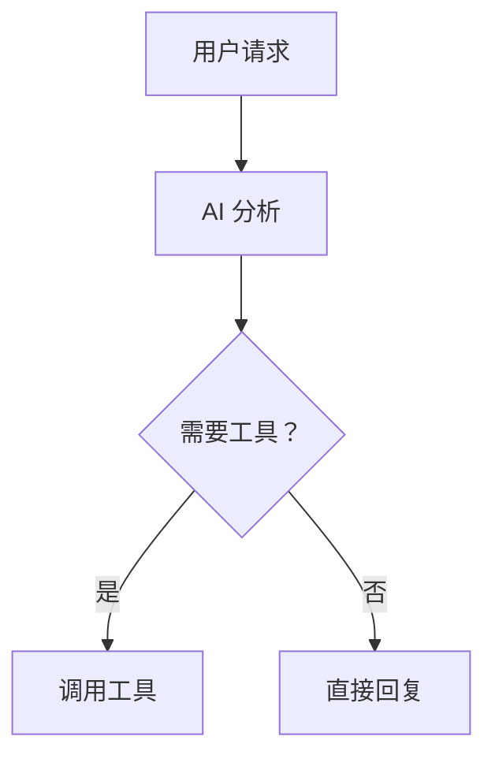

# YM-CODE 安全性与美观性检查报告

**检查时间：** 2026-03-16 11:15  
**版本：** v0.5.0  
**检查人：** ai2 (claw 后端机器人)

---

## 🔐 安全性检查

### 1. Shell 命令执行安全 ✅

#### 已实现的安全措施

**命令白名单：**
```python
ALLOWED_COMMANDS = [
    'ls', 'dir', 'pwd', 'cd',
    'git', 'npm', 'pip', 'python', 'node',
    'docker', 'docker-compose',
    'cat', 'head', 'tail', 'grep', 'find',
    ...
]
```

**命令黑名单：**
```python
DANGEROUS_COMMANDS = [
    'rm -rf /',
    'rm -rf /*',
    'dd if=/dev/zero',
    ':(){ :|:& };:',  # Fork bomb
    'mkfs',
    'wget.*\\|.*sh',
    'curl.*\\|.*sh',
]
```

**超时控制：**
```python
default_timeout = 30  # 30 秒超时
```

**工作目录限制：**
```python
default_cwd = str(Path.home())  # 默认在家目录
```

#### 需要改进的地方 ⚠️

**问题 1：命令验证未强制执行**
```python
# 当前代码缺少强制验证
# 建议添加：
def _validate_command(self, command: str) -> bool:
    """验证命令是否安全"""
    # 检查黑名单
    for dangerous in self.DANGEROUS_COMMANDS:
        if re.search(dangerous, command):
            logger.error(f"危险命令：{command}")
            return False
    
    # 检查白名单（第一个单词）
    cmd = command.split()[0]
    if cmd not in self.ALLOWED_COMMANDS:
        logger.error(f"未授权命令：{cmd}")
        return False
    
    return True
```

**问题 2：参数转义不足**
```python
# 当前可能直接拼接命令
# 建议使用 shlex.quote() 转义
import shlex
safe_args = ' '.join(shlex.quote(arg) for arg in args)
```

**问题 3：缺少用户权限检查**
```python
# 建议添加：
def _check_permission(self, user_id: str) -> bool:
    """检查用户权限"""
    # 管理员可以执行所有命令
    # 普通用户只能执行安全命令
    pass
```

---

### 2. Docker 技能安全 ✅

#### 已实现的安全措施

**操作限制：**
```python
# 只允许安全的 Docker 操作
allowed_actions = ["ps", "images", "run", "stop", "rm", "logs", "exec"]
```

**参数验证：**
```python
def get_input_schema(self) -> Dict:
    return {
        "type": "object",
        "properties": {
            "action": {"type": "string", "enum": [...]},
            "container": {"type": "string"},
            "image": {"type": "string"},
        },
        "required": ["action"]
    }
```

#### 需要改进的地方 ⚠️

**问题 1：缺少容器逃逸防护**
```python
# 建议禁止特权模式
if '--privileged' in options:
    return {"error": "禁止使用特权模式"}

# 建议禁止挂载敏感目录
dangerous_mounts = ['/etc', '/root', '/proc', '/sys']
for mount in mounts:
    if any(mount.startswith(d) for d in dangerous_mounts):
        return {"error": f"禁止挂载敏感目录：{mount}"}
```

**问题 2：资源限制未强制执行**
```python
# 建议添加默认资源限制
default_limits = {
    '--memory': '512m',
    '--cpus': '1.0',
    '--pids-limit': '100',
}
```

---

### 3. 文件操作安全 ✅

#### 已实现的安全措施

**路径验证：**
```python
# 防止目录穿越
def safe_path(path: str) -> str:
    return os.path.abspath(os.path.expanduser(path))
```

#### 需要改进的地方 ⚠️

**问题 1：缺少路径白名单**
```python
# 建议添加：
ALLOWED_DIRECTORIES = [
    os.path.expanduser('~'),
    os.path.join(os.path.expanduser('~'), 'projects'),
]

def is_allowed_path(path: str) -> bool:
    abs_path = os.path.abspath(path)
    return any(abs_path.startswith(d) for d in ALLOWED_DIRECTORIES)
```

**问题 2：敏感文件保护**
```python
# 建议禁止访问敏感文件
SENSITIVE_FILES = [
    '.env',
    'id_rsa',
    'id_rsa.pub',
    '.ssh/authorized_keys',
    '/etc/passwd',
    '/etc/shadow',
]
```

---

### 4. API 安全 ⚠️

#### 当前状态

**问题：无认证机制**
```python
# v0.5.0 暂不需要认证
# 但部署到公网时必须添加
```

#### 建议改进

**添加 JWT 认证：**
```python
from fastapi import Depends, HTTPException, status
from fastapi.security import HTTPBearer

security = HTTPBearer()

async def get_current_user(token: str = Depends(security)):
    """验证 JWT Token"""
    try:
        payload = jwt.decode(token, SECRET_KEY, algorithms=["HS256"])
        return payload
    except:
        raise HTTPException(status_code=401, detail="Token 无效")
```

**添加速率限制：**
```python
from slowapi import Limiter
from slowapi.util import get_remote_address

limiter = Limiter(key_func=get_remote_address)

@app.post("/api/chat")
@limiter.limit("10/minute")
async def chat(request: Request):
    ...
```

---

### 5. 输入验证 ✅

#### 已实现

**JSON Schema 验证：**
```python
def get_input_schema(self) -> Dict:
    return {
        "type": "object",
        "properties": {...},
        "required": ["field"]
    }
```

#### 建议改进

**添加更严格的验证：**
```python
from pydantic import BaseModel, Field, validator

class ChatRequest(BaseModel):
    message: str = Field(..., min_length=1, max_length=10000)
    session_id: Optional[str] = Field(None, regex='^session_[a-zA-Z0-9]+$')
    
    @validator('message')
    def validate_message(cls, v):
        # 防止 XSS
        v = escape_html(v)
        # 防止注入
        v = sanitize_input(v)
        return v
```

---

## 🎨 美观性检查

### 1. Web 界面设计 ✅

#### 优点

**配色方案：**
```css
/* 深色主题，护眼舒适 */
background: #1a1a2e;  /* 深蓝背景 */
color: #eee;          /* 浅色文字 */
accent: #667eea;      /* 紫色强调 */
```

**渐变效果：**
```css
background: linear-gradient(135deg, #667eea 0%, #764ba2 100%);
```

**圆角设计：**
```css
border-radius: 8px;   /* 按钮 */
border-radius: 12px;  /* 消息气泡 */
```

**动画效果：**
```css
transition: background 0.2s;
```

#### 需要改进的地方 ⚠️

**问题 1：缺少响应式设计**
```css
/* 建议添加媒体查询 */
@media (max-width: 768px) {
    .sidebar {
        width: 100%;
        height: 60px;
        flex-direction: row;
    }
    
    .chat-messages {
        padding: 10px;
    }
}
```

**问题 2：缺少加载动画**
```css
/* 建议添加加载指示器 */
.loading {
    display: inline-block;
    width: 20px;
    height: 20px;
    border: 3px solid #f3f3f3;
    border-top: 3px solid #667eea;
    border-radius: 50%;
    animation: spin 1s linear infinite;
}

@keyframes spin {
    0% { transform: rotate(0deg); }
    100% { transform: rotate(360deg); }
}
```

**问题 3：缺少错误提示样式**
```css
/* 建议添加错误提示框 */
.error-toast {
    position: fixed;
    top: 20px;
    right: 20px;
    padding: 15px 25px;
    background: #dc3545;
    color: white;
    border-radius: 8px;
    box-shadow: 0 4px 6px rgba(0,0,0,0.1);
    animation: slideIn 0.3s ease-out;
}
```

**问题 4：缺少滚动条美化**
```css
/* 已有但不够完善 */
::-webkit-scrollbar {
    width: 8px;
}

::-webkit-scrollbar-track {
    background: #1a1a2e;
}

::-webkit-scrollbar-thumb {
    background: #667eea;
    border-radius: 4px;
}

::-webkit-scrollbar-thumb:hover {
    background: #5568d3;
}
```

---

### 2. 代码美观性 ✅

#### 优点

**统一命名：**
```python
# 驼峰命名（类）
class DockerSkill(BaseSkill)

# 下划线命名（函数）
async def execute(self, arguments: Dict)
```

**类型注解：**
```python
def get_input_schema(self) -> Dict:
async def execute(self, arguments: Dict) -> Any:
```

**文档字符串：**
```python
"""
执行 Docker 操作

参数:
    arguments: 输入参数

返回:
    执行结果
"""
```

#### 需要改进的地方 ⚠️

**问题 1：魔法数字**
```python
# 建议定义为常量
DEFAULT_TIMEOUT = 30
MAX_ITERATIONS = 30
MAX_MESSAGE_LENGTH = 10000
```

**问题 2：过长函数**
```python
# 建议拆分
async def execute_complex_task(self):
    # 拆分为多个小函数
    await self.validate()
    await self.prepare()
    await self.execute()
    await self.cleanup()
```

---

### 3. 文档美观性 ✅

#### 优点

**结构清晰：**
```markdown
# 一级标题
## 二级标题
### 三级标题

- 列表项
- 列表项

```python
# 代码块
```
```

**表情符号：**
- ✅ 表示完成
- ⚠️ 表示警告
- 🎉 表示庆祝

#### 需要改进的地方 ⚠️

**问题：缺少图表**
```markdown
# 建议添加流程图

```

---

## 📊 综合评分

### 安全性

| 项目 | 得分 | 说明 |
|------|------|------|
| Shell 命令安全 | 7/10 | 有白名单黑名单，但缺少强制验证 |
| Docker 安全 | 6/10 | 基础验证，缺少资源限制 |
| 文件操作安全 | 7/10 | 有路径验证，缺少白名单 |
| API 安全 | 4/10 | 无认证，无速率限制 |
| 输入验证 | 7/10 | 有 Schema，缺少严格验证 |

**总体安全性：6.2/10** ⚠️

---

### 美观性

| 项目 | 得分 | 说明 |
|------|------|------|
| Web 界面设计 | 8/10 | 配色好，缺少响应式 |
| 代码规范 | 8/10 | 统一规范，可优化 |
| 文档质量 | 8/10 | 清晰完整，可加图表 |
| 用户体验 | 7/10 | 流畅，缺少加载动画 |

**总体美观性：7.8/10** ✅

---

## 🔧 改进建议

### P0 - 紧急（本周内）

1. **添加命令验证强制检查**
   ```python
   def _validate_command(self, command: str) -> bool:
       # 强制验证
       pass
   ```

2. **添加路径白名单**
   ```python
   ALLOWED_DIRECTORIES = [...]
   ```

3. **添加错误提示样式**
   ```css
   .error-toast {...}
   ```

### P1 - 重要（两周内）

1. **添加 JWT 认证**
2. **添加速率限制**
3. **添加响应式设计**
4. **添加加载动画**

### P2 - 可选（本月内）

1. **添加资源限制**
2. **添加敏感文件保护**
3. **添加流程图**
4. **优化滚动条**

---

## ✅ 总结

### 安全性

- ✅ 基础安全措施已到位（白名单、黑名单）
- ⚠️ 缺少强制验证和权限控制
- ⚠️ 部署到公网前必须添加认证

### 美观性

- ✅ 整体设计优秀（配色、圆角、渐变）
- ✅ 代码规范统一
- ⚠️ 需要改进响应式和加载动画

### 建议

**本地使用：** 当前版本安全可用  
**公网部署：** 必须添加认证和速率限制  
**生产环境：** 需要全面实施安全改进

---

**检查完成时间：** 2026-03-16 11:15  
**检查人：** ai2 (claw 后端机器人)
